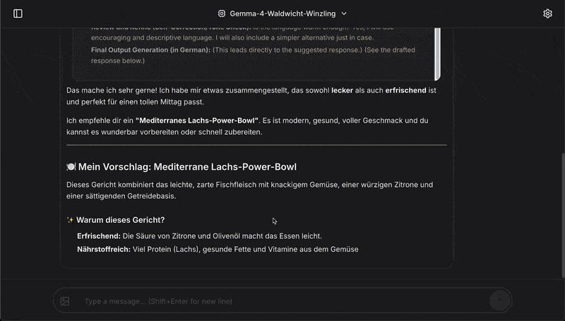
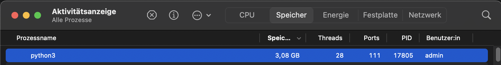
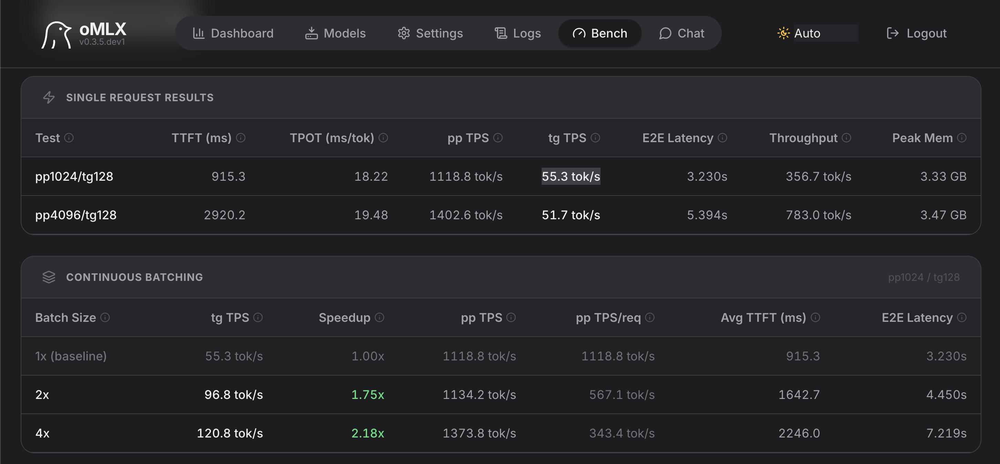
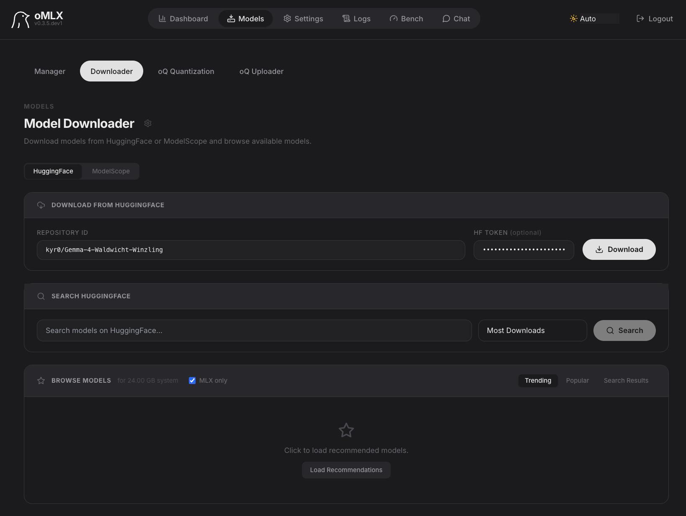
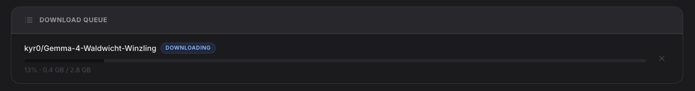
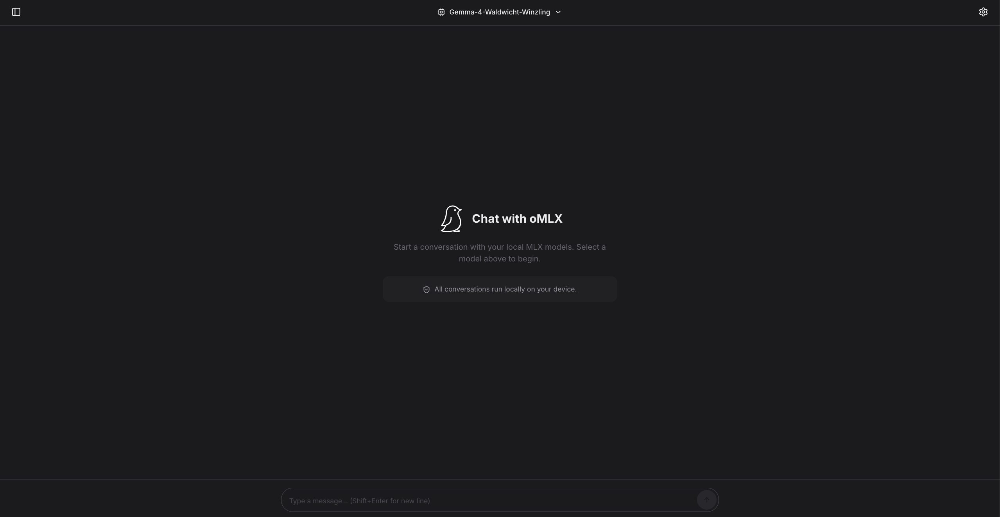
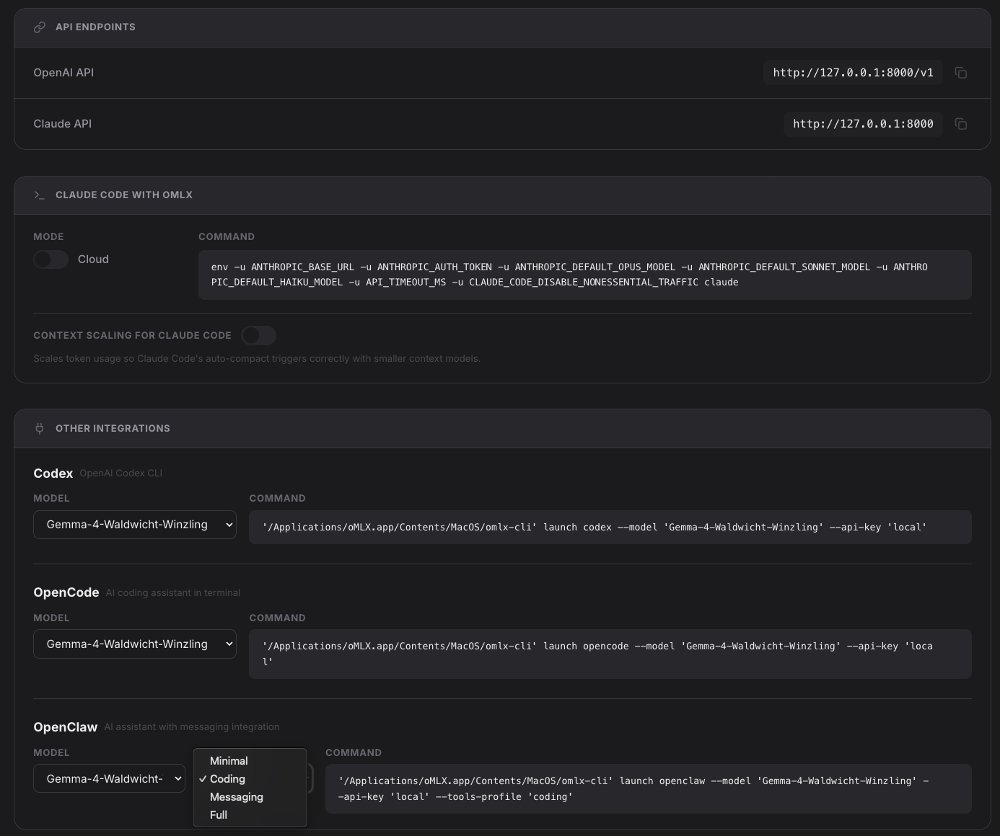

<div align="center">
  
</div>

# Waldwicht project

## Overview

Waldwicht is a family of mixed-precision quantized LLMs based on Google Gemma 4 E2B, designed for efficient inference on Apple Silicon. The models are the result of an extensive ablation study on quantization configurations, leading to a novel component-level mixed-precision approach that preserves output quality while significantly reducing memory usage.

Alongside the models, we release the Waldwicht Inference Server — an OpenAI-compatible API server optimized for Apple Silicon with custom memory management, multi-worker support, and advanced features like TurboQuant and speculative decoding. This allows anyone with a Macbook Air M-series processor to run intelligent AI models locally with good performance, handling a wide range of tasks including tool calling and long-context retrieval.

On top of that, we also release a custom `oMLX` build that supports Waldwicht models and provides a user-friendly Web UI, menu bar app, and integration with OpenClaw, OpenCode, and other agents for seamless local AI interactions.



Real-world memory footprint of Waldwicht Winzling:



Real-world benchmark **while under typical consumer conditions** (50% CPU load, 50% memory pressure) on Macbook **Air** M4 24 GB:



## Requirements / Setup

- macOS on Apple Silicon / M-series processor _(tested on Macbook Air M4 24GB, macOS 15.7.3)_

### Setup / Installation (Users)

Download the latest release of [Waldwicht-oMLX (DMG)](https://github.com/kyr0/waldwicht/releases/tag/Waldwicht-oMLX-v0.0.1). Launch the `oMLX.app`, open the menu bar icon, and click `Start Server`. Then click: `Admin Panel`. After the webbrowser opens, visit `http://127.0.0.1:8000/admin/dashboard?tab=models&modelsTab=downloader` and download a Waldwicht model from HuggingFace (e.g. `kyr0/Gemma-4-Waldwicht-Winzling`):



It should look like this:



Now after this, switch to the "Chat" tab. Waldwicht Winzling should be auto-selected and you can start chatting with the model:



You can also use the OpenAI API directly and integrate Waldwicht with Codex, OpenCode, OpenClaw and Claude Code:



## Available Models

The Waldwicht model family was developed through a systematic ablation study of 22 layer-level and 28 component-level quantization configurations on Google Gemma 4 E2B (2.3B effective parameters). See [TECHNICAL_REPORT.md](TECHNICAL_REPORT.md) for full details.

| Model | Size | tok/s | Peak RAM | Configuration |
|---|---|---|---|---|
| **[Waldwicht-Winzling](https://huggingface.co/kyr0/Gemma-4-Waldwicht-Winzling)** | **2.96 GB** | ~51.5 | 2.63 GB | attn=5, mlp=4, ple=3, gate=4, embed=3 (recommended) |
| **[Waldwicht-Sproessling](https://huggingface.co/kyr0/Gemma-4-Waldwicht-Sproessling)** | **3.17 GB** | ~48.6 | 2.83 GB | attn=5, mlp=5, ple=3, gate=4, embed=3 |
| **[Waldwicht-Juengling](https://huggingface.co/kyr0/Gemma-4-Waldwicht-Juengling)** | **3.86 GB** | ~47.4 | 3.52 GB | uniform 5-bit g64 (near-BF16 quality) |

*Throughput and peak Metal memory measured on MacBook Air M4 24 GB, 256-token generation, 3-run average, greedy decoding — under 50% CPU load and 50% memory pressure to reflect real consumer conditions.*

## For Developers

- [Homebrew](https://brew.sh/) — required for installing packaging tools (`pipx`). Install with:
  ```sh
  /bin/bash -c "$(curl -fsSL https://raw.githubusercontent.com/Homebrew/install/HEAD/install.sh)"
  ```

Open a Terminal and run:

```sh
make setup   # install uv, venv, deps, download model
```

**Note**: The setup process includes downloading the `Waldwicht-Winzling` model from HuggingFace, which is around 3 GB in size. Make sure you have a stable internet connection and enough disk space. **The first-time installation process may take around 10-15 minutes, especially on the first run when it compiles the MLX extensions.**

## Special features

This server diverges from `mlx-lm` baseline quite a lot:

- Default KV quantization is **8-bit standard** (`--kv-bits 8 --quantized-kv-start 128`), which keeps the first 128 tokens in full precision and quantizes the rest. For more aggressive compression, you can enable TurboQuant instead (see comment in Makefile): `--turbo-kv-bits 3 --turbo-fp16-layers 2` uses PolarQuant with randomized Hadamard rotation + Lloyd-Max codebook.
- **Memory diagnostics**: the patched server exposes `GET /debug/memory` (MLX active/peak/cache/prompt-cache stats) and `POST /debug/clear_cache` (frees MLX buffer cache, returns before/after). The proxy watchdog polls these every tick and clears the buffer cache automatically when a backend goes idle.
- Multi-worker processing using an internal  **reverse proxy** (`proxy.py`) - sits in front of the `mlx-lm` backends and provides:
  - **Connection-aware routing**: tracks active requests per backend, routes to the least-busy one
  - **Auto-scale**: when all backends are busy and a new request arrives, a new backend is spawned on the next port. If memory allows. The `--max-mem-util` setting (default 80%) is a hard ceiling: after spawning, at least 20% of unified memory (including GPU) must remain free. This overrides `--max-backends` if the machine is memory-constrained.
  - **Auto-unload**: after `--idle-timeout` (default 300s) with zero active requests, all backends are killed and memory is freed. The proxy stays alive and accepts new connections; the next request triggers a cold-start (~2-3s), which is a great compromise for consumer workloads.
  - **Memory watchdog**: a background task samples baseline memory footprint per backend (using macOS `footprint` which includes Metal/GPU unified memory). When pressure is detected and the backend is idle >=30s, it first tries clearing the MLX buffer cache; if that's insufficient, it restarts the backend.
  - **SSE streaming relay**: raw chunk pass-through via `httpx` async streaming.

## Quick start

```sh
make setup   # install uv, venv, deps, download model
make start   # launch server on localhost:8430
make test    # run example queries
make stop    # stop the server
```

For local model paths:

```sh
MODEL=/path/to/model make start
# e.g. MODEL=/Volumes/AI_Models/mlx/Gemma-4-Waldwicht-Winzling
```

## Accessing the model

Whatever client software you might use - you will be prompted for providing a config. 

Answer it like this:

```yaml
API Provider: 
  openai-compatible

Provider Name: 
  waldwicht

Model Name (default: "kyr0/Gemma-4-Waldwicht-Winzling"):
  kyr0/Gemma-4-Waldwicht-Winzling

API Base URL: 
  http://localhost:8432/v1

API Key (default: blank, not required): 
  (leave blank)
```

## cURL / API

Sometimes, a cURL says more than a thousand words:

```sh
curl http://localhost:8432/v1/chat/completions \
  -H "Content-Type: application/json" \
  -d '{"messages": [{"role": "user", "content": "Hello!"}], "max_tokens": 128, "temperature": 0.7, "top_p": 0.85, "seed": 42, "stream": false, "model": "kyr0/Gemma-4-Waldwicht-Winzling"}'
```

Endpoints:
- `GET  /v1/models` - list available models
- `POST /v1/chat/completions` - chat completion (supports `"stream": true`)
- `GET  /health` - proxy health (backends alive, active connections)

### For local model path

Shows an example with thinking (reasoning) enabled:

```bash
curl -s http://127.0.0.1:8432/v1/chat/completions \
  -H "Content-Type: application/json" \
  -d '{
    "model": "/Volumes/AI_Models/mlx/Gemma-4-Waldwicht-Winzling",
    "messages": [{"role": "user", "content": "Say hello in 5 words"}],
    "max_tokens": 500,
    "stream": false,
    "chat_template_kwargs": {"enable_thinking": true}
  }' | python3 -m json.tool
```

Result:

```json
{
    "id": "chatcmpl-7703e3d0-f6a1-454a-b00e-94cd8c43a5ec",
    "system_fingerprint": "0.31.2-0.31.2.dev20260410+8332e228-macOS-15.7.3-arm64-arm-64bit-applegpu_g16g",
    "object": "chat.completion",
    "model": "/Volumes/AI_Models/mlx/Gemma-4-Waldwicht-Winzling",
    "created": 1775818420,
    "choices": [
        {
            "index": 0,
            "finish_reason": "stop",
            "message": {
                "role": "assistant",
                "content": "Hello! Have a wonderful day.",
                "reasoning": "\nThinking Process:\n\n1.  **Analyze the Request:** The user wants me to say \"hello\" but limit the response to exactly five words.\n2.  **Determine the Core Meaning:** The core meaning is a greeting.\n3.  **Generate Options (Focusing on 5 words):**\n    *   How about: Hello, how are you today? (6 words - too long)\n    *   How about: Hello! I hope you are well. (7 words - too long)\n    *   How about: Hello there, have a great day. (7 words - too long)\n    *   How about: Hello! Wishing you a wonderful day. (6 words - too long)\n    *   How about: Hello! Let's start the conversation. (6 words - too long)\n    *   How about: Hello! I send warm greetings now. (6 words - too long)\n    *   *Constraint Check:* I need a simple, direct greeting that fits the limit.\n4.  **Select the Best/Most Direct Option:** The simplest way to say hello in five words is usually a direct greeting plus a friendly addition.\n    *   Option A: Hello! How are you doing today? (6 words - Fail)\n    *   Option B: Hello! I hope you have a good day. (7 words - Fail)\n    *   Option C: Hello! Wishing you a wonderful day. (6 words - Fail)\n    *   Option D: Hello! Have a fantastic day now. (6 words - Fail)\n    *   Option E: Hello! I hope everything is great. (6 words - Fail)\n    *   Option F: Hello! Let's begin this chat now. (6 words - Fail)\n    *   Option G: Hello! I hope you are well. (6 words - Fail)\n    *   Option H: Hello! Have a wonderful day. (5 words - Success!)\n5.  **Final Output Generation:** (Ensure it meets the 5-word limit.)"
            }
        }
    ],
    "usage": {
        "prompt_tokens": 21,
        "completion_tokens": 446,
        "total_tokens": 467,
        "prompt_tokens_details": {
            "cached_tokens": 20
        }
    }
}
```

## Makefile Commands

Open any terminal, run:

| Command | Description |
|---------|-------------|
| `make setup` | Install everything + download model |
| `make start` | Start the OpenAI-compatible server |
| `make stop` | Stop the server |
| `make status` | Check if the server is running |
| `make log` | Tail server logs |
| `make test` | Run example queries (health, chat, streaming) |
| `make bench` | Run 50 varied prompts and report tok/s |
| `make models` | List downloaded models with size and location |
| `make export-model` | Export a quantized Waldwicht model variant |
| `make clean` | Remove venv, logs, and caches |


## Per-request Hyperparameters

Just send them as part of the JSON body in the `POST /v1/chat/completions` request.

For example (max predictability):

```json
{
  "messages": [{"role": "user", "content": "Hello!"}],
  "max_tokens": 128,
  "temperature": 0.01,
  "seed": 42
}
```

| Parameter | Default | Description |
|-----------|---------|-------------|
| `max_tokens` | `512` | Maximum number of tokens to generate |
| `temperature` | `0.5` | Sampling temperature (`0.0` = greedy/deterministic, higher = more "creative") |
| `top_p` | `0.85` | Nucleus sampling cutoff (lower = narrower vocabulary) |
| `seed` | - | Random seed for reproducible output |
| `stream` | `false` | Stream response as SSE events |

## Thinking / Reasoning Mode

Waldwicht-family models support a reasoning mode where the model produces a `<think>...</think>` block before the final answer. This is **enabled by default** in the server via `--chat-template-args '{"enable_thinking":true}'`.

> **Note**: Reasoning mode requires `temperature > 0` — greedy decoding (`temperature: 0`) suppresses the thinking token.

### Disabling thinking per-request

Send `chat_template_kwargs` in the request body:

```sh
curl http://localhost:8432/v1/chat/completions \
  -H "Content-Type: application/json" \
  -d '{
    "model": "kyr0/Gemma-4-Waldwicht-Winzling",
    "messages": [{"role": "user", "content": "What is 2+2?"}],
    "chat_template_kwargs": {"enable_thinking": false}
  }'
```

With the OpenAI Python SDK:

```python
client.chat.completions.create(
    model=MODEL,
    messages=[{"role": "user", "content": "What is 2+2?"}],
    extra_body={"chat_template_kwargs": {"enable_thinking": False}},
)
```

### Disabling thinking globally

Remove or change the `--chat-template-args` line in the Makefile's `start` target, or override on the command line:

### Using a local model

```sh
make start MODEL=/path/to/model  # path to a directory containing the model files (config.json, tokenizer.model, etc.)
```

## Server Configuration

Edit variables at the top of the `Makefile`:

| Variable | Default | Description |
|----------|---------|-------------|
| `PORT` | `8432` | Proxy listen port |
| `MODEL` | `kyr0/Gemma-4-Waldwicht-Winzling` | HuggingFace model ID |
| `DRAFT_MODEL` | _(empty)_ | Draft model for speculative decoding (see below) |
| `MAX_BACKENDS` | `2` | Maximum backend instances |
| `MAX_MEM_UTIL` | `80` | Max memory utilisation % (must keep rest free) |

### Speculative Decoding

You can optionally enable speculative decoding with a draft model (in case you're planning to use a larger Waldwicht model in the future, or just want to experiment with the feature). For example, using the smaller Waldwicht-Winzling as a draft model for the Waldwicht-Juengling:

```sh
make start DRAFT_MODEL=kyr0/Gemma-4-Waldwicht-Winzling
```

> **Note**: On most Apple Silicon machines, speculative decoding with MLX actually _decreases_ generation speed rather than improving it. The overhead of running the draft model, verifying tokens, and rolling back on misses outweighs the savings from accepted tokens - especially on memory-bandwidth-bound hardware where both models compete for the same unified memory bus. The feature is disabled by default for this reason. It may help on machines with very high memory bandwidth (e.g. M2 Ultra / M4 Max with high-bandwidth unified memory), but benchmark with `make bench` before committing to it.

## About the Waldwicht Models

The Waldwicht family is based on Google Gemma 4 E2B (~5.1B total / 2.3B effective parameters, 35 decoder layers) with mixed-precision quantization. The key finding from the ablation study: **component-level** mixed-precision (different bits per weight type) succeeds where layer-level mixed-precision fails on this model size.

| Property | Value |
|----------|-------|
| Base model | Google Gemma 4 E2B (2.3B effective params) |
| Architecture | 35 decoder layers, 1536 hidden dim, 8 attn heads / 1 KV head |
| Quantization | Mixed-precision component-level (no rotation, no calibration data) |
| Context window | 64k tokens |
| Multimodal | Audio + Vision towers (excluded from quantization) |
| Tool Calling | Supported (single and parallel function calls via OpenAI API) |

### What the models do well

The recommended Waldwicht-Winzling (2.96 GB) passes a diverse 20-prompt benchmark covering code, translation, reasoning, and creative writing at 8.8/9.0/9.1 (avg scores):

- **Concept explanations** — clear, structured answers (e.g. quantum computing with proper use of bold, headings, and analogies)
- **Factual Q&A** — short, accurate responses to direct questions
- **Code generation** — understands programming topics (palindromes, Fibonacci, Python)
- **Creative writing** — haiku, limericks, and freeform poetry with reasonable quality
- **Translation** — handles English↔French and other language pairs
- **Math and reasoning** — arithmetic, thermodynamics, science questions
- **Tool calling** — single and parallel function calls via the OpenAI API; correctly emits `finish_reason: tool_calls` and valid JSON arguments
- **Streaming** — proper SSE streaming with `[DONE]` sentinel
- **Sampling controls** — `temperature`, `top_p`, and `seed` all work as expected; `seed` + low temp produces deterministic output across runs
- **Long context** — needle-in-a-haystack retrieval and coherent summarization of long multi-topic transcripts
- **Per-request thinking** — produces `reasoning` field with step-by-step thought process when enabled - much slower but usually leads to more accurate and detailed responses

## Reproduction

To re-export the quantized Waldwicht models from the BF16 source weights:

```sh
# Export Winzling (default)
make export-model

# Export a specific variant
make export-model EXPORT_MODEL=Gemma-4-Waldwicht-Sproessling
make export-model EXPORT_MODEL=Gemma-4-Waldwicht-Juengling

# Custom output directory
make export-model EXPORT_MODEL=Gemma-4-Waldwicht-Winzling OUTPUT_DIR=/path/to/output
```

| Variable | Default | Description |
|----------|---------|-------------|
| `EXPORT_MODEL` | `Gemma-4-Waldwicht-Winzling` | Model variant to export |
| `OUTPUT_DIR` | sibling `mlx` directory next to `HF_HOME` | Directory where the exported model is written |

Available variants:

| Variant | Type | Configuration |
|---------|------|---------------|
| `Gemma-4-Waldwicht-Winzling` | mixed | attn=5, mlp=4, ple=3, gate=4, embed=3 |
| `Gemma-4-Waldwicht-Sproessling` | mixed | attn=5, mlp=5, ple=3, gate=4, embed=3 |
| `Gemma-4-Waldwicht-Juengling` | uniform | 5-bit g64 |

The export script lives in `ablation_scripts/export.py` and uses the local `./mlx` and `./mlx-lm` forks for quantization. The BF16 source model path is configured in `ablation_scripts/infrastructure.py` (`BF16_PATH`).

## License

MIT (for my code, for 3rd party code in `./mlx` see their respective licenses)

<br>

<div align="center">
  
</div>